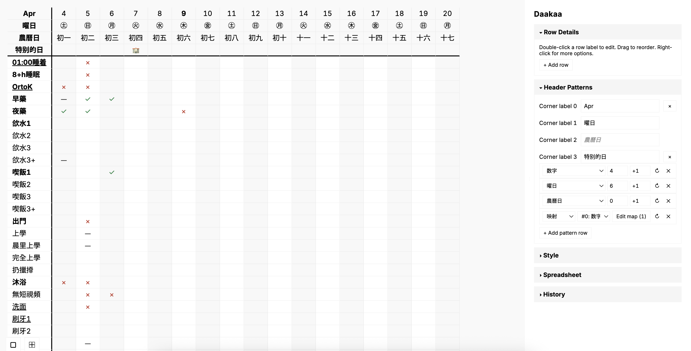

# Daakaa (打卡)

An Excel-style check-in tracker that runs entirely in the browser — no server, no framework, no build step.

**Live site:** https://soizo.github.io/Daakaa/



---

## Overview

Daakaa is a spreadsheet-style tool for tracking daily check-ins, habits, or any repeating activity against a list of rows. It stores all state in `localStorage`, works offline, and can be installed as a PWA. The interface is intentionally minimal: a grid with sticky headers, a sidepanel for configuration, and a small set of cell values drawn from CJK conventions.

The application is a single HTML file and a vanilla JS/CSS pair — no transpilation, no dependencies beyond two CDN libraries.

---

## Features

### Spreadsheet

- Sticky column headers and sticky left column at all zoom levels
- Configurable column count (1–366)
- Zoom in/out with `Cmd +` / `Cmd -` / `Cmd 0` or mouse wheel
- Shift+click range selection and batch cell operations
- View mode — read-only with drag-to-pan; style and header configuration remain editable

### Cell values

| Value     | Meaning                  |
| --------- | ------------------------ |
| `✓`       | Check / done             |
| `×`       | Cross / absent           |
| `〇`      | Circle                   |
| `—`       | Dash / N/A               |
| `←N✓`     | Arrow-count (e.g. `←3✓`) |
| _(empty)_ | No entry                 |

### Header patterns

Multiple header rows can be stacked. Each row uses one of the built-in patterns or a custom value list:

| Pattern | Content                                       |
| ------- | --------------------------------------------- |
| 曜日    | Day-of-week circles (㊐–㊏), cyclic           |
| 数字    | Integers with configurable start and step     |
| 農曆日  | Lunar calendar days (初一–三十), cyclic       |
| 農曆月  | Lunar months (正月–臘月), cyclic              |
| 英文月  | English month abbreviations (Jan–Dec), cyclic |
| Custom  | Arbitrary comma-separated values              |
| Mapping | Per-column value overrides                    |

Individual header cells can be overridden directly.

### Row formatting

Per-row **bold**, **underline**, and ~~strikethrough~~ formatting, set via the Row Details panel.

### Style

- Customisable accent colour with a four-tier colour system (`--t1` through `--t4`)
- Colour scope: header cells only, all cells, or accent (borders and icons)
- Alternating columns (default on) and alternating rows (default off), independently toggled
- Configurable font family (default: [Sarasa UI CL](https://github.com/be5invis/Sarasa-Gothic))

### History

- Node-based undo/redo tree, capped at 500 nodes
- History panel shows the full branch tree and allows jumping to any prior state
- `Cmd+Z` / `Cmd+Shift+Z` / `Cmd+Y`

### Import and export

- **xlsx import** via SheetJS — reads existing spreadsheets into the grid
- **xlsx export** via ExcelJS — produces a styled workbook with merged cells and formatting
- **Project export/import** — saves and restores the full application state as a gzip-compressed `.daakaa.gz` file (uses the browser's Compression Streams API; no server required)

### Responsive layout

- Wide viewport (≥ 769 px): sidepanel docked to the right
- Narrow viewport (≤ 768 px): panel slides up from the bottom with a drag handle

### Touch-first UI

Input model detection is decoupled from viewport width. The device type (touch vs mouse) is resolved once at startup from User Agent signals, not from screen size:

- `body.input-touch` — 44 px touch targets throughout, 16 px input floor (prevents iOS Safari zoom), 1.125× type scale, `:active` states in place of hover
- `body.input-mouse` — standard desktop interaction: double-click to edit cells inline, hover states, drag-to-select ranges

All four combinations of input model × viewport width are valid first-class states.

### PWA

Installable as a standalone app on iOS, iPadOS, Android, and desktop Chrome. Uses the browser's native caching — no service worker required.

---

## Getting started

Daakaa is a static site. To use it:

**Online:** visit https://soizo.github.io/Daakaa/

**Locally:** clone the repository and open `index.html` directly in a browser. No build step is required.

```bash
git clone https://github.com/soizo/Daakaa.git
cd Daakaa
open index.html   # macOS; or just drag the file into your browser
```

The application loads SheetJS and ExcelJS from jsDelivr CDN. An internet connection is required on first load for these libraries; subsequent loads use the browser cache.

---

## Keyboard shortcuts

| Shortcut                | Action                                          |
| ----------------------- | ----------------------------------------------- |
| `V`                     | Set selected cells to `✓`                       |
| `X`                     | Set selected cells to `×`                       |
| `O`                     | Set selected cells to `〇`                      |
| `-`                     | Set selected cells to `—`                       |
| `,`                     | Cycle selected cells through the value sequence |
| `Delete` / `Backspace`  | Clear selected cells                            |
| `Cmd Z`                 | Undo                                            |
| `Cmd Shift Z` / `Cmd Y` | Redo                                            |
| `Cmd +` / `Cmd =`       | Zoom in                                         |
| `Cmd -`                 | Zoom out                                        |
| `Cmd 0`                 | Reset zoom                                      |
| `Escape`                | Deselect / dismiss                              |
| `Shift`+click           | Extend selection to range                       |

Cell value shortcuts apply to the entire selection. They are active when a cell or range is selected and no text input has focus. Keyboard shortcuts remain available in touch mode (for devices with an attached keyboard).

---

## URL parameters

The input model is detected automatically from the User Agent. You can override it with a URL parameter:

| Parameter      | Effect                                              |
| -------------- | --------------------------------------------------- |
| `?input=touch` | Force touch mode (persists to `localStorage`)       |
| `?input=mouse` | Force mouse mode (persists to `localStorage`)       |
| `?input=auto`  | Clear the stored override, revert to auto-detection |

This is useful when automatic detection is wrong — for example, on a touch-screen Windows laptop where you want touch mode, or on an iPad with a Magic Keyboard where you want full mouse/keyboard behaviour.

---

## Tech stack

| Component                | Technology                                                                                                                |
| ------------------------ | ------------------------------------------------------------------------------------------------------------------------- |
| Application              | Vanilla HTML, CSS, and JavaScript (no framework)                                                                          |
| xlsx read                | [SheetJS](https://sheetjs.com/) `xlsx@0.18.5` (jsDelivr CDN)                                                              |
| xlsx write               | [ExcelJS](https://github.com/exceljs/exceljs) `4.4.0` (jsDelivr CDN)                                                      |
| Project file compression | [Compression Streams API](https://developer.mozilla.org/en-US/docs/Web/API/Compression_Streams_API) (browser-native gzip) |
| PWA                      | Web App Manifest                                                                                                          |
| State persistence        | `localStorage`                                                                                                            |

---

## Licence

Copyright 2026 Daakaa Contributors.

Licensed under the [Apache Licence, Version 2.0](LICENSE).
